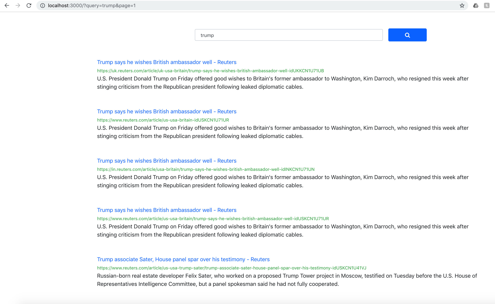

# Search-Engine

### SearchWebCrawler (Java)
Scrapped data from reuters using Crawler4j.
```
{ 
  "url": {
    "path":"\",
    "parentPage":parent_url,
    "anchorText":anchor_tag,
    "docId":1,
    "subDomain":"www",
    "domain":"reuters.com",
    "html":html_content,
    "title": page_title,
    "url":page_url
    }
 }
```

### SearchDataCleaning (Scala)
Implemented spark job for removing scripts from scrapped data. Extract image tags from the scrapped data with the description to tag images.

### SearchPageRanking (Java, Python, networkx)
Created DAG from url mapping, used python networkx to generate pagerank scoring.

### SearchBackend (Spring Boot)
Created API to access indexed data from Solr and ElasticSearch

### Searchfrontend (ReactJs)




